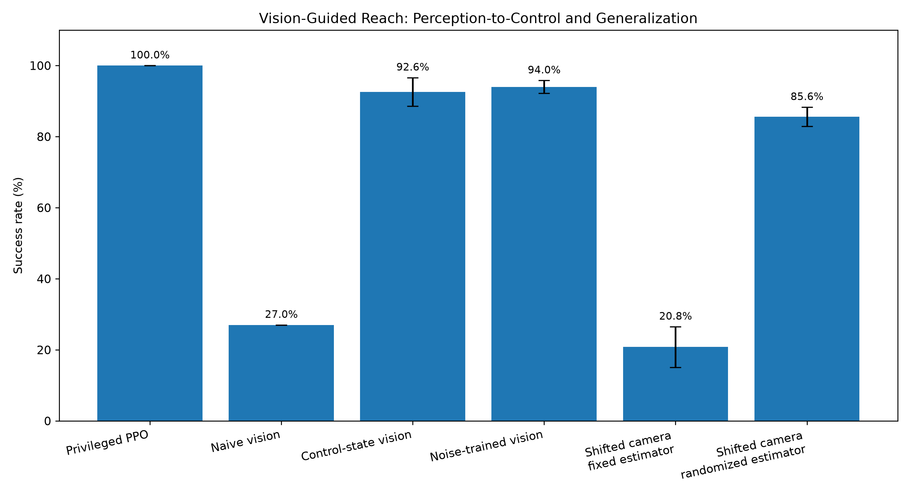

# Vision-Guided Robot Manipulation

A simulation-based robotics project studying how perception error affects closed loop control.

The system uses a PyBullet Franka Panda robot, a ResNet-18 camera based 3D goal estimator, and PPO policies trained for Cartesian reaching.

The main objective is to quantify the gap between policies using perfect simulator state and policies driven by camera estimated state, then test interventions that improve robustness.

## Key Result

The privileged PPO policy achieved 100% success with exact simulator state.

Replacing the exact goal position with camera predictions reduced performance, exposing both perception distribution shift and viewpoint sensitivity.

After diagnosing these failures, control state data collection and camera randomization substantially recovered performance.



## Results

| Condition | Success Rate | Mean Steps | Final Distance |
| --- | ---: | ---: | ---: |
| Random baseline | 17.0% | 44.58 | 23.36 cm |
| Privileged PPO | 100.0% ± 0.0% | 2.65 ± 0.02 | 3.05 cm |
| Naive closed-loop vision | 27.0% | 37.02 | 34.05 cm |
| Control-state vision + standard PPO | 92.6% ± 4.0% | 6.58 ± 1.96 | 4.06 cm |
| Control-state vision + noisy PPO | 94.0% ± 1.8% | 6.24 ± 0.63 | 4.05 cm |
| Shifted camera + fixed estimator | 20.8% ± 5.7% | 41.18 ± 2.03 | 13.26 cm |
| Shifted camera + randomized estimator | 85.6% ± 2.7% | 10.70 ± 1.49 | 5.44 cm |

Five-seed policy evaluations use 100 fixed evaluation episodes per seed.

## Main Findings

### Perception-to-control gap

The privileged PPO policy achieved:

```text
100.0% success